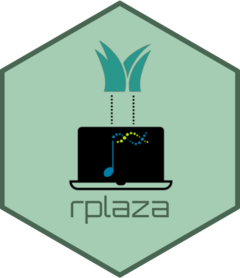

<!-- README.md is generated from README.Rmd. Please edit that file -->

```{r, include = FALSE}
knitr::opts_chunk$set(
    collapse = TRUE,
    comment = "#>",
    fig.path = "man/figures/README-",
    out.width = "100%"
)
```

# rplaza 

<!-- badges: start -->
[](https://github.com/almeidasilvaf/rplaza/issues)
[](https://github.com/almeidasilvaf/rplaza/actions/workflows/check-bioc.yml)
[](https://app.codecov.io/gh/almeidasilvaf/rplaza?branch=devel)
<!-- badges: end -->

The goal of __rplaza__ is to provide users with an R interface to 
the [PLAZA](https://bioinformatics.psb.ugent.be/plaza.dev/)
database of plant comparative genomics. __rplaza__ can be used to retrieve PLAZA 
data (e.g., genome and locus sequences, genome annotation, functional 
annotation, homology, etc) directly from an R session using 
standard R/Bioconductor data classes.

## Overview

__rplaza__ functions and the data they retrieve are summarized below:

```{r echo=FALSE}
overview <- data.frame(
    fnc = c(
        "*get_genome()*", 
        "*get_sequences()*", 
        "*get_annotation()*",
        "*get_functional_annotation()*",
        "*get_tx2gene()*",
        "*get_id_conversions()*",
        "*get_descriptions()*",
        "*get_family_assignments()*",
        "*get_family_functions()*",
        "*get_block_duplicates()*"
    ),
    desc = c(
        "Genome sequences", 
        "Locus sequences (proteins, transcripts, CDS)",
        "Genomic coordinates of genes",
        "Functional annotation (GO, InterPro, MapMan)",
        "Transcript-to-gene ID mapping",
        "Correspondence between alternative gene IDs",
        "Short gene descriptions",
        "Gene family assignments",
        "Overrepresented functions for gene families",
        "Block (segmental or whole-genome) duplicates"
    ),
    bioc_class = c(
        "*DNAStringSet*", 
        "*DNAStringSet* / *AAStringSet*",
        "*GRanges*",
        rep("*data.frame*", 7)
    )
)

knitr::kable(overview, col.names = c("Function", "Data retrieved", "R/BioC class"))
```

## Installation instructions

Get the latest stable `R` release from [CRAN](http://cran.r-project.org/). 
Then install `rplaza` from [Bioconductor](http://bioconductor.org/) using the following code:

```{r 'install', eval = FALSE}
if (!requireNamespace("BiocManager", quietly = TRUE)) {
    install.packages("BiocManager")
}

BiocManager::install("rplaza")
```

And the development version from [GitHub](https://github.com/almeidasilvaf/rplaza) with:

```{r 'install_dev', eval = FALSE}
BiocManager::install("almeidasilvaf/rplaza")
```

## Citation

Below is the citation output from using `citation('rplaza')` in R. Please
run this yourself to check for any updates on how to cite __rplaza__.

```{r 'citation', eval = requireNamespace('rplaza')}
print(citation('rplaza'), bibtex = TRUE)
```

If you use __rplaza__, please also cite:

> Van Bel, M., Silvestri, F., Weitz, E. M., Kreft, L., Botzki, A., Coppens, F., & Vandepoele, K. (2022). PLAZA 5.0: extending the scope and power of comparative and functional genomics in plants. Nucleic Acids Research, 50(D1), D1468-D1474.

## Code of Conduct

Please note that the `rplaza` project is released with a [Contributor Code of Conduct](http://bioconductor.org/about/code-of-conduct/). By contributing to this project, you agree to abide by its terms.
